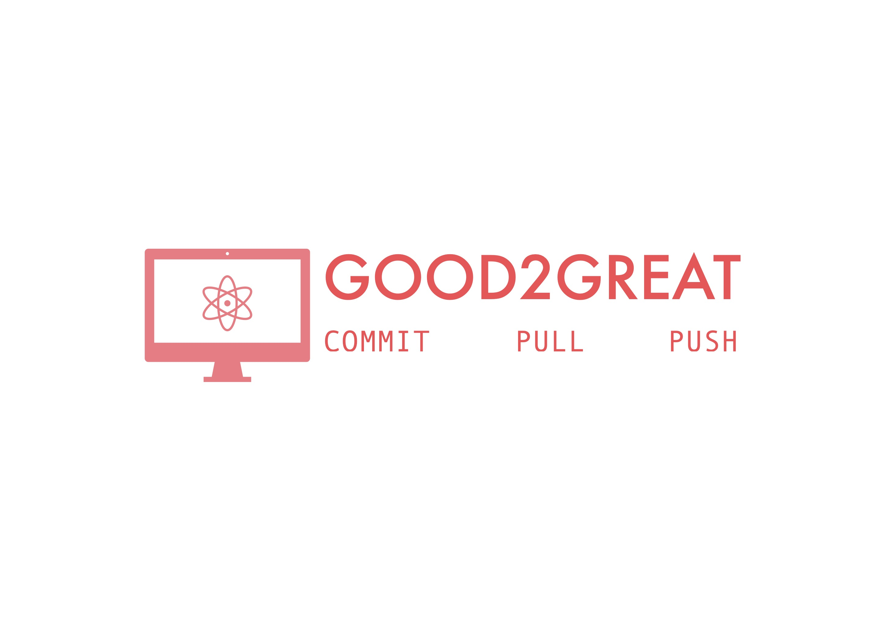

<p align="center">


# Good2Great Repo
</p>

<p align="center">

[comment]: <> ([![Issues]&#40;https://img.shields.io/github/issues/NCSU-Group7-SE2021/group7_hw2b&#41;]&#40;https://github.com/NCSU-Group7-SE2021/group7_hw2b/issues&#41;)
[comment]: <> ([![Forks]&#40;https://img.shields.io/github/forks/NCSU-Group7-SE2021/group7_hw2b&#41;]&#40;https://github.com/NCSU-Group7-SE2021/group7_hw2b/network/members&#41;)
[](https://github.com/NCSU-Group7-SE2021/group7_hw2b/blob/main/LICENSE)
[](https://zenodo.org/record/5367393#.YTApFI5KhPY)
[](https://github.com/NCSU-Group7-SE2021/group7_hw2b/actions/workflows/application.yml)
[](https://app.travis-ci.com/github/NCSU-Group7-SE2021/group7_hw2b/pull_requests)
[](https://github.com/NCSU-Group7-SE2021/group7_hw2b/actions/workflows/application.yml)

[comment]: <> (![Size]&#40;https://github-size-badge.herokuapp.com/NCSU-Group7-SE2021/group7_hw2b.svg&#41;)
</p>


This repository aims to provide a basic example of a `Good Reporsitory`. There are several ideas of what can we consider as a good repository. Some ideas of such projects that we all come across are:
1. Well-defined project structure
2. Good coding practices like indentations and comments
3. A comprehensible ReadMe file (what we hope to provide with this one)
4. A brief `How to use` guide
5. Some automated workflows

## Table of Content
1. [Installation](#installation)
2. [License](#license)
3. [Meet the contributors](#meet-the-contributors)
4. [Additional Link](#additional-link)

## Installation
A guide to direct user on how to install the repository is a step towards making a descriptive project. Here is our guide on how to install this project on your local environment

This project support both python2.x and python3.x. However, python2.x is deprecated. 
Unix machines have preinstalled python 2.x.

To install python 3.x, please refer the following guides

1. MacOS: [Install Python3](https://docs.python-guide.org/starting/install3/osx/).
2. Linux: [Install Python3](https://docs.python-guide.org/starting/install3/linux/)
3. Windows: [Install Python3](https://docs.python.org/3/using/windows.html)

Once python is installed, please verify by checking the version in the terminal. To check, use the following command:

`python --version` 

Once done, run the following command to install the library
```bash
python setup.py install
```

## License

Each repository should get a license. To understand more about licensing, please refer [this](https://docs.github.com/en/github/creating-cloning-and-archiving-repositories/creating-a-repository-on-github/licensing-a-repository)

This repository is [MIT licensed](https://github.com/NCSU-Group7-SE2021/group7_hw2b/blob/main/LICENSE).  

## Meet the contributors

1. [Eshita Arza](https://github.com/ArzaEshita)
2. [Isha Gupta](https://github.com/isha-bansal0115)
3. [Kiran Teja](https://github.com/kirantejatummuri)
4. [Luis](https://github.com/lgdeloss)
5. [Rahul Kalita](https://github.com/rahulkalita8)
6. [Vignesh Muthukumar](https://github.com/vickymhs)

## Additional Link
1. Want to contribute? [Here](CONTRIBUTING.md) is how you can do it.
2. Project Standards? Say no more. [Read this](CODE_OF_CONDUCT.md)
